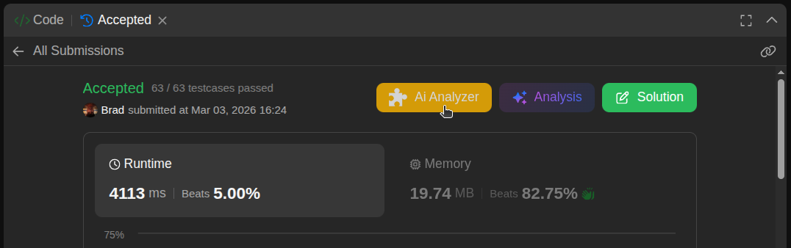

# DSA Analyzer

A Chrome extension that analyzes DSA code from LeetCode submissions using the OpenRouter API.

## Features

- Provides complexity analysis, readability feedback, and improvement suggestions.
- Integrates with LeetCode submission pages.
- Securely stores your API key using `chrome.storage`.

## Setup

1.  Open Chrome, navigate to `chrome://extensions`, and enable "Developer mode".
2.  Click **Load unpacked** and select the `Dsa-reviewer-extension` project folder.
3.  Click the extension's icon in your browser toolbar.

## Testing

### Automated Testing
Ensure pwd is Dsa-reviewer-extension.
Run the test suite using `node test/test_v1.js`.
Check the test/results/ for test results

### Manual Testing

Navigate to a LeetCode submission page. (e.g., https://leetcode.com/submissions/detail/1234567890/)

Click the extension's icon in your browser toolbar.
The extension's background script will be able to access the code for analysis when triggered.
Open Developer Tools (F12) and check the console for logs and results from the background script.

## Usage

Once set up, navigate to a LeetCode submission page. The extension's background script will be able to access the code for analysis when triggered.
